# Privacy vriendelijk gebruik van Sportlink

## Voorwoord

In 2015 is gekeken of Sportlink (het verplichte leden administratie systeem van o.a. Reddingsbrigade Nederland voor aangesloten verenigingen) kon worden ingezet om ST-RBM gegevens op te slaan en als primair ledenadministratie ingezet te worden. Het systeem leek hiervoor destijds geschikt waarna begonnen is de gegevens uit ST-RBM te migreren. Vlak voor de aanvang van het seizoen 2016 heeft Sportlink hierbij de module voor het vastleggen van het rooster zonder aankondiging verwijderd. Deze wijze heeft zich op kleinere en vergelijkbare schaal sindsdien meermaals voorgedaan.

Daarnaast is tevens gebleken dat andere aangesloten verenigingen onze gegevens konden inzien en/of muteren. Dit heeft er toe geleid dat privacy gevoelige gegevens van onze leden bij andere verenigingen, alsmede het rayon en de bond, kunnen worden ingezien. Ook andersom heeft dit geresulteerd in het feit dat onze vereniging ongewenst privacy gevoelige informatie van leden toegespeeld heeft gekregen vanuit andere verenigingen.

Ook is gebleken dat de bond met regelmaat leden tegenkomt bij onze vereniging die geen uniek lidnummer hebben. Zij verwijderen in dat geval het lid bij ons (omdat wij vaak de 2de vereniging zijn) en voeren het lid weer op met zijn andere lidnummer. Hierbij onstaan drie problemen;
  * het lid is in onze administratie ineens pas sinds kort lid.
     i.e. de orginele datum van aanvang lidmaatschap wordt door de bond niet overgenomen.
  * de interne bevoegdheden van het lid worden op lidnummer vastgelegd.
     i.e. het lid heeft ineens geen interne bevoegdheden meer. Indien de wijziging wordt teruggedraaid kan het 
     probleem ook andersom voorkomen en krijgt het lid reeds vervallen bevoegdheden terug.
  * de gegevens van het lid in de administratie wijken vaak af of ontbreken ineens bij het lid omdat het lid door
     ons bewerkt is onder zijn vorig lidnummer in het systeem terwijl het lidnummer dat is toegevoegd niet door
     ons beheerd is. Denk hierbij aan NAW, contactgegevens, betaalgegevens, etc.

De ervaring heeft inmiddels dus geleerd dat het systeem van de bond niet betrouwbaar is om onze data in te beheren op basis van beschikbaarheid (i.e. modules worden zonder aankondiging verwijderd), integriteit (gegevens kunnenzonder meer worden aangepast door derden of worden verwijderd door derden) en vertrouwelijkheid (gegevens kunnen door derden worden ingezien).

Dit betekend dat de inzet van het systeem van de bond beperkt dient te worden tot de minimale set gegevens die wij verplicht zijn hierin op te voeren. Dit brengt mede met zich mee dat het systeem niet bruikbaar is als ons primaire administratiesysteem maar ingezet dient te worden als een kopie m.b.t. de gegevens die wij verplicht zijn te delen met de bond. Ook daar is overgens een discrepantie tussen het Huishoudelijk Reglement van de bond waarin de verplicht te delen gegevens zijn opgenomen en de verwerkersovereenkomst welke dient als juridische grondslag voor het delen van de gegevens. Daarover meer in hoofdstuk 3 bij de toelichting op de inrichting van de leden administratie zelf.

## Gebruikers beheren

Binnen Sportlink kun je gebruikers aanmaken en eventueel koppelen aan rollen. Deze rollen bieden echter onvoldoende mogelijkheden om bevoegdheden daadwerkelijk te scheiden. Het advies is daarom deze niet te gebruiken en de toegang/aantal gebruikers zoveel mogelijk te beperken binnen de vereniging.

Om in te loggen in Sportlink dien je te beschikken over een actief account binnen Sportlink voor de vereniging. Het aanmaken van accounts en rollen binnen de vereniging gebeurd door . Dit geld ook voor het resetten van wachtwoorden. Neem hiervoor contact op de secretaris.

Noot:  
Sportlink beschikt over een vast geprogrammeerde gebruikersaccount “beheer”. Dit account dient niet gebruikt te worden aangezien hiermee niet te herleiden is door wie dit account gebruikt is/wordt. Indien iedereen zijn toegang kwijt raakt kan het wachtwoord worden gereset. Dit wachtwoord wordt dan gemaild naar het verenigingsadres (welke gelijk is aan het master recovery account van Office 365).

Het gebruikersbeheer kan gestart worden via; Vereniging \> Beheer \>
Gebruikersbeheer  
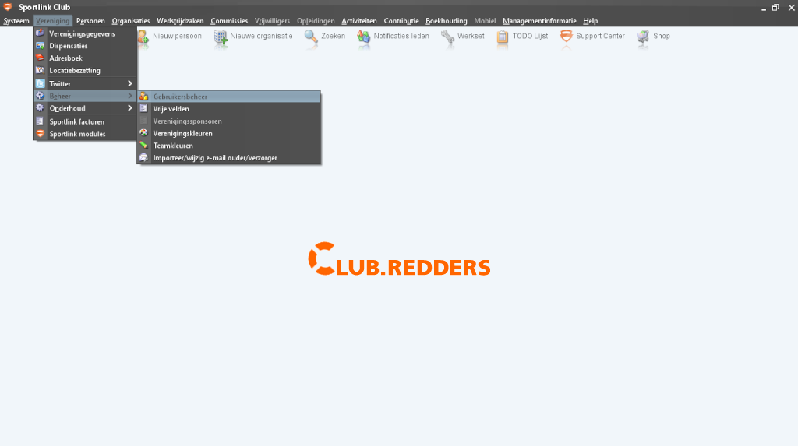

Application menu flow

Het Gebruikers en Rollen scherm start op:
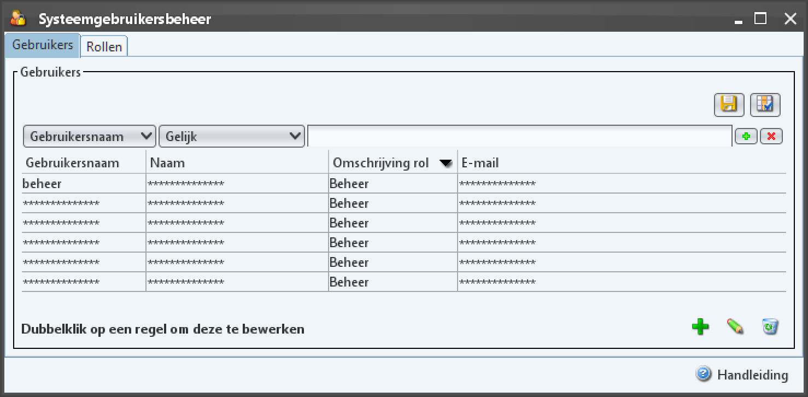

Active users

In dit scherm zie je de gebruikers en hun toegekende rol binnen Sportlink. De
gebruikersnaam “beheer” is standaard en deze gebruiker is niet aan te passen.

### Aanmaken

Maak een nieuwe gebruiker aan door op  te klikken;
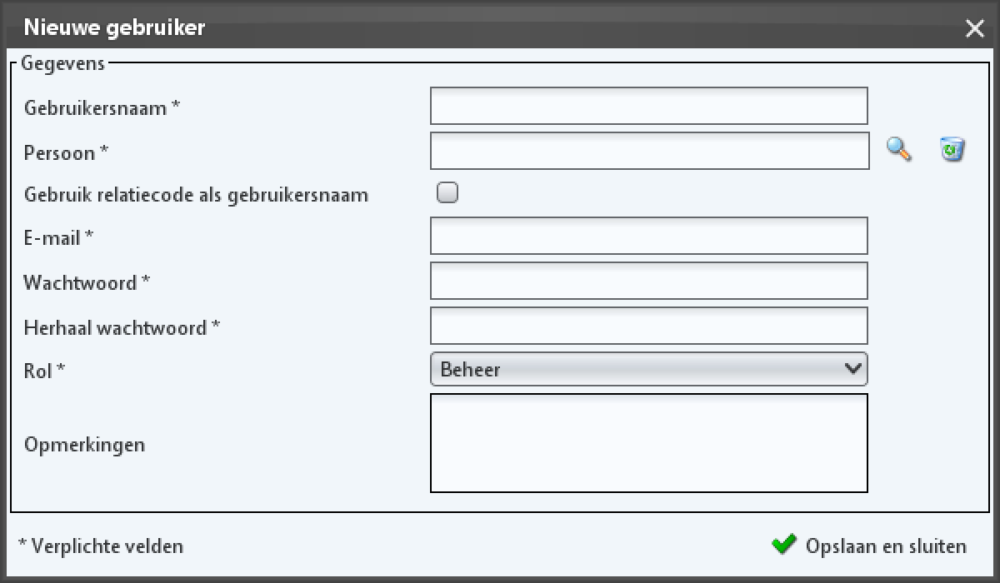

Create a new user

1.  Vul de gebruikersnaam met het relatienummer van het lid waarvoor je het
    account maakt, gevolgd door “\@trb.nu”, bijvoorbeeld: D123ABC\@trb.nu;

2.  Zoek de persoon waarvoor je een gebruiker wilt aanmaken door een deel van de naam te typen en deze aan te vullen of op te zoeken via het vergrootglas.

3.  Vink “Gebruik relatiecode als gebruikersnaam” *niet* aan. (We gebruiken namelijk overal de relatiecode\@trb.nu als inlognaam; Office 365, Website, Club.Redders, MachForm, Akounting, etc.)

4.  Het E-mail adres word automatisch gevuld maar dient aangepast te worden naar D123ABC\@trb.nu zodat de inlog gegevens en wachtwoord herstel mail naar het Office 365 account van het lid wordt gestuurd. Zo onstaat er een meer geintegreerde gebruikerservaring.

5.  Vul een initieel wachtwoord in, bij het eerste gebruik dient de gebruiker
    deze te wijzigen.
    
6.  Selecteer de rol “Beheer”.  Deze rol beschikt over alle rechten binnen Sportlink. In het verleden hebben we met additionele rollen gewerkt maar het rolmodel van Sportlink zit zo slecht in elkaar dat je binnen onze vereniging uiteindelijk vaak alsnog de beheer rechten moet toekennen. Het onderhoud van meerdere rollen brengt dan enkel complexiteit.

8.  Het veld opmerkingen wordt niet gebruikt.

### Wijzigen

Wijzig een gebruiker aan door op  te klikken (ook voor wachtwoord mutaties);
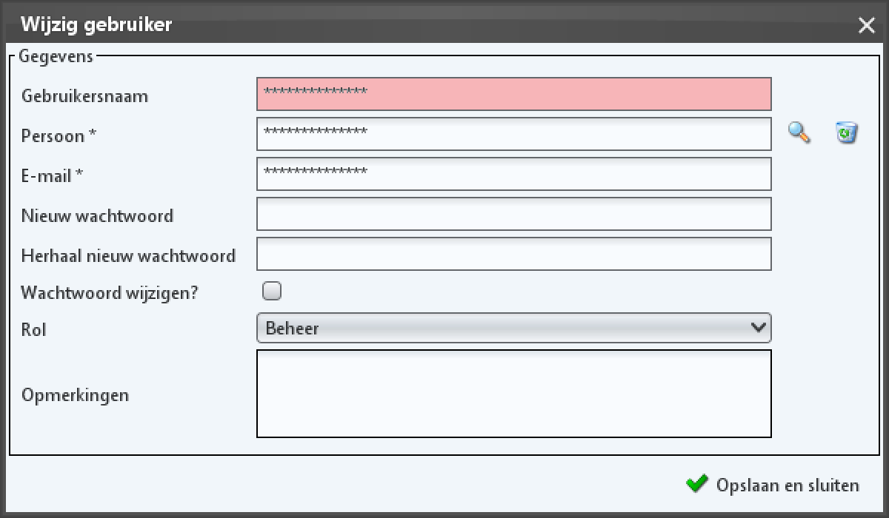

Update an existing user

1.  De gebruikersnaam kun je niet aanpassen;

2.  De persoon die aan een gebruiker is gekoppeld kun je wel aanpassen. Doe dit niet!

3.  Het E-mail adres word automatisch aangepast als dit wijzigd bij de lid
    gegevens. Pas hiervoor op zodat dit blijft staan zoals toegelicht in §2.1
    stap 4.

4.  Je kunt wijzig gebruiker ook gebruiken indien het wachtwoord gereset moet worden.

5.  Heb je een wachtwoord aangepast? Vink dan “Wachtwoord wijzigen?” aan. De gebruiker krijgt dan net als bij de eerste keer inloggen de vraag het wachtwoord te wijzigen.

### Verwijderen

Om een gebruiker te verwijderen selecteer je de gebruiker en klik je op.

### Persoonlijke gebruikersinstellingen

Nadat de gebruiker is aangemaakt dient hij/zij in te loggen en de
scherminstellingen aan te passen conform de bijlage achteraan in dit document. Wijs de gebruiker op deze bijlagen na het aanmaken van zijn/haar account.

## Leden administratie

Zoals in de inleiding toegelicht dient het systeem van de bond beperkt te worden ingezet en dienen gegevens van onze leden tot het minimale te worden beperkt om, zover mogelijk, te voldoen aan wet en regelgeving.

In onderstaande paragraven worden de te delen gegevens toegelicht in relatie tot de wet en regelgeving binnen de Europese Unie. In dit document wordt daarbij specifiek ingezoemt op de regeles binnen de KNBRD.

Club.Redders voldoet aan de geldende wet en regelgeving binnen de Europese Unie. Daarmee kunnen zelfstandige verenigingen zonder meer gebruik maken van Club.Redders. Verenigingen welke zijn aangesloten bij een van de volgende bonden kunnen hier ook gebruik van maken maar zij dienen eveneens rekening te houden met het gebruik van het leden administratie systeem van hun bond en de daarvoor afgesproken regels m.b.t. het delen van gegevens;

Nederlandse bonden;  
[Atletiekunie](https://www.atletiekunie.nl/)  
[JBN](https://www.jbn.nl/)  
[KNBRD](https://www.reddingsbrigade.nl/)  
[KNBSB](https://www.knbsb.nl/)  
[KNHB](https://www.knhb.nl/)  
[KNKF](https://knkf.nl/)  
[KNKV](https://www.knkv.nl/)  
[KNVB](https://www.knvb.nl/)  
[KNZB](https://www.knzb.nl/)  
[NBB](https://www.basketball.nl/)  
[Nevobo](https://www.nevobo.nl/)  
[NHV](https://www.handbal.nl/)  

Belgische bonden;  
[KBHB](https://hockey.be/)  

### Te delen gegevens

De gegevens van onze leden die wij beschikbaar dienen te stellen aan de bond staan opgenomen in het Huishoudelijk Regelement (HR) en is toegelicht in §3.1.1. Deze komen niet volledig overeen met de vastgelegde gegevens in de concept verwerkersovereenkomst (VO) van de bond, toegelicht in §3.1.2. Het verschil is daarom opgenomen en uitgewerkt in §3.1.3.

#### HR KNBRD versie 1-11-2018 - Artikel 10. Verplichtingen, lid 1;

Verenigingen zijn verplicht jegens de Bond om hun ledenadministratie actueel te houden en regelmatig (minimaal eens per kwartaal bij aanvang van het kwartaal) bij te werken. De opgave bevat tenminste naam, adres, woonplaats en geboortedatum van de ingeschrevenen. Hiertoe wordt gebruik gemaakt van via de Bond beschikbaar gestelde [naam leverancier] programmatuur. De
ledenadministratie van de vereniging dient schriftelijke bewijsstukken te
bevatten waaruit blijkt dat de in de administratie van de vereniging opgenomen ingeschrevenen zich uitdrukkelijk als zodanig hebben opgegeven en dat voor het betrokken jaar door hen een bedrag is afgedragen.

#### VO RN 29 juli 2019 - Artikel 4: aard en doel van de verwerking, onder a;

De volgende persoonsgegevens worden door Reddingsbrigade Nederland verwerkt:

-   naam; - relatiecode betrokkene;

-   geslacht; - relatiecode Brigade;

-   geboortedatum; - land;

-   adres; - doopnamen (voor instructeursopleidingen)

-   (mobiele) telefoonnummer;

-   e-mailadres;

-   geboorteplaats (voor instructeursopleidingen)

-   overige door de Brigade naar eigen inzicht aangeleverde persoonsgegevens;

#### Conclusie te delen gegevens

Als we de genoemde gegevens (als attributen) vergelijken met elkaar en het
systeem zelf komen we tot het volgende overzicht;

| **Attributen**                  | **HR**                                                          | **VO**                                                                     | **Systeem van de bond - (Personen - tabblad Persoon)**    |
|---------------------------------|-----------------------------------------------------------------|----------------------------------------------------------------------------|-----------------------------------------------------------|
| Relatiecode Brigade             | \-                                                              | X                                                                          | Menu Vereniging \> Verenigingsgegevens \> Verenigingscode |
| Relatiecode Lid                 | \-                                                              | X                                                                          | Knop Relatiecode                                          |
| Relatiecode initiële import     | Niet vermeld\*                                                  | Interne code                                                               |                                                           |
| Relatiecode extern pakket       | Niet vermeld\*                                                  | Externe code                                                               |                                                           |
| Naam                            | X                                                               | X                                                                          | Achternaam, Tussenvoegsel(s), Roepnaam, Voorletter(s)     |
| Doopnamen (voor inst.opl.)      | \-                                                              | X                                                                          | GEEN SPORTLINK VELD (beperkt tot voorletter(s) in SL.     |
| Adres                           | X                                                               | X                                                                          | Postcode, Huisnummer, Toevoeging, Straatnaam              |
| Woonplaats                      | X                                                               | \-                                                                         | Plaats                                                    |
| Land                            | \-                                                              | X                                                                          | Land                                                      |
| Geboortedatum                   | X                                                               | X                                                                          | Geboortedatum                                             |
| Geboorteplaats (voor inst.opl.) | \-                                                              | X                                                                          | Geboorteplaats                                            |
| Geslacht                        | \-                                                              | X                                                                          | Geslacht                                                  |
| E-mailadres                     | \-                                                              | X                                                                          | E-mail                                                    |
| Mobielnnummer                   | \-                                                              | X                                                                          | Mobiel                                                    |
| Telefoonnummer                  | \-                                                              | X                                                                          | Telefoon (optioneel)                                      |
| Datum start lidmaatschap        | Niet vermeld\*                                                  | Lid sinds                                                                  |                                                           |
| Overige SL velden Pers.gegevens | *Beschikbare velden in het systeem welke niet in gebruik zijn.* | Bijnaam, Bedrijfsnaam, Overlijdensdatum                                    |                                                           |
| Overige SL velden Legitimatie   |                                                                 | Nationaliteit, 2e Nationaliteit, Geboorteland, Legitimatie, Legitimatienr. |                                                           |
| Overige SL velden Comm.&privacy |                                                                 | Selectievakjes en dropdown privacyniveau                                   |                                                           |

\*) niet vermeld in HR en VO maar wel in gebruik!

Dit overzicht in acht nemend kunnen we de attributen onderverdelen in 3 type;

1.  Verplicht te delen gegevens  
    Dit zijn de attributen die wij volgens het HR verplicht zijn te delen. In
    het systeem van de bond staan deze op het moment van schrijven verzameld
    onder Personen – tabblad Persoon, sectie Persoonsgegvens (Bondslid). Het
    betreft hier;

    -   Achternaam

    -   Tussenvoegsel(s)

    -   Roepnaam

    -   Voorletter(s)

    -   Geslacht

    -   Geboortedatum

    -   Geboorteplaats

    -   Lid sinds

De volgende velden uit deze sectie worden niet gebruikt omdat deze ook niet gedeeld hoeven te worden en deze bij ons niet nodig zijn;

-   Bijnaam

-   Bedrijfsnaam

-   Externe code

-   Overlijdensdatum

In de sectie Adresgegevens worden vervolgens gedeeld;

-   Postcode

-   Huisnummer

-   Plaats

-   Straatnaam

-   Toevoeging

-   Land

Met bovestaande voldoen we conform HR aan de attributen naam, adres (inclusief woonplaats en land) en geboortedatum. In aavulling daarop (formeel niet onderbouwd door het HR maar wel door de concept VO) wordt volgens VO gedeeld de doopnamen als zijnde voorletters, geboorteplaats (t.b.v. mogelijke instructeurs opleidingen) en geslacht. Daarnaast hebben we nog start lidmaatschap. Dit veld is niet benoemd in het HR of de VO maar is wel afgedwongen door het systeem. Dit is tevens het veld dat door de bond
bij mutaties niet goed beheerd wordt. Hetzelfde geld hier voor de impliciete velden;

-   Relatiecodes;

    -   Brigade, benoemd in de VO en is verenigingsgebonden.  
        Dit veld is in het systeem niet direct zichtbaar bij een lid zelf.

    -   Lid, het daadwerkelijk door het systeem gebruikte nummer.  
        Dit nummer kan ingezien worden als men op de knop Relatiecode bij het
        lid klikt.

    -   *Interne code, een niet zichtbare code die beheerd wordt per lid.*  
        *Bij de ingebruik name zijn hier de oorspronkelijke lidnummers van de
        vereniging geimporteerd. Voor nieuwe leden wordt hier via een bepaalde
        nummering op doorgeteld. Dit nummer is wel in gebruik maar niet benoemd
        in het HR/VO.*

    -   *Externe code, een code die de vereniging kan invullen zoals deze in een
        eventueel extern pakket in gebruik is als lidnummer voor het betreffende
        lid.*  
        *Het advies is dit nummer op dit moment niet te gebruiken en het z.g.n.
        relatienummer te gebruiken.*

1.  Optioneel te delen gegevens  
    Dit zijn de attributen die wij volgens het HR niet verplicht zijn te delen,
    maar wel zijn opgenomen in de concept VO & welke diverse andere brigade’s al
    ingevuld hebben en daarmee toch beschikbaar zijn. Deze attributen kunnen
    optioneel in het systeem beheerd worden; In het systeem van de bond staan
    deze op het moment van schrijven verzameld onder Personen – tabblad Persoon,
    sectie Communicatie & privacy. Het betreft hier;

-   Telefoon

-   Mobiel

-   E-mail

Let op, formeel is er geen grondslag voor het delen van deze gegevens.

1.  Verboden te delen gegevens  
    Dit zijn de attributen die niet zijn benoemd in het HR én de concept VO. Daarnaast zijn deze gegevens ook te bestempelen als bijzondere     persoonsgegevens. Het systeem beidt hiervoor echter wel velden en deze staan op het moment van schrijven verzameld onder Personen – tabblad Persoon, sectie Legitimatie. Het betreft hier;

-   Nationaliteit

-   2e Nationaliteit

-   Geboorteland

-   Legitimatie

-   Legitimatienr.

### Algemene eisen

Dit document bevat de inrichtings instructies die vereist zijn om Club.Redders
te kunnen gebruiken. Hierbij word ervan uitgegaan dat op de tabbladen bij de
leden de velden zijn gevuld conform deze instructie. Voor het tabblad “Persoon” is het daarbij extra van belang dat deze exact overeenkomen.

**Let op: géén enkel veld in SportLink mag een komma , of puntkomma ;
bevatten.**  
Bij het gebruik van deze tekens kan data niet correct uit SportLink geëxporteerd worden.
Sportlink controleerd hier echter niet op!

Voor een goed gebruik van Sportlink zijn enkel de volgende tabbladen voor
persoonen nodig;

-   Persoon

-   Sport

-   Verenigingsfuncties

-   Bondsfuncties

### Inzet van velden bij het tabblad persoon

Het tabblad Persoon bestaat uit 5 secties;

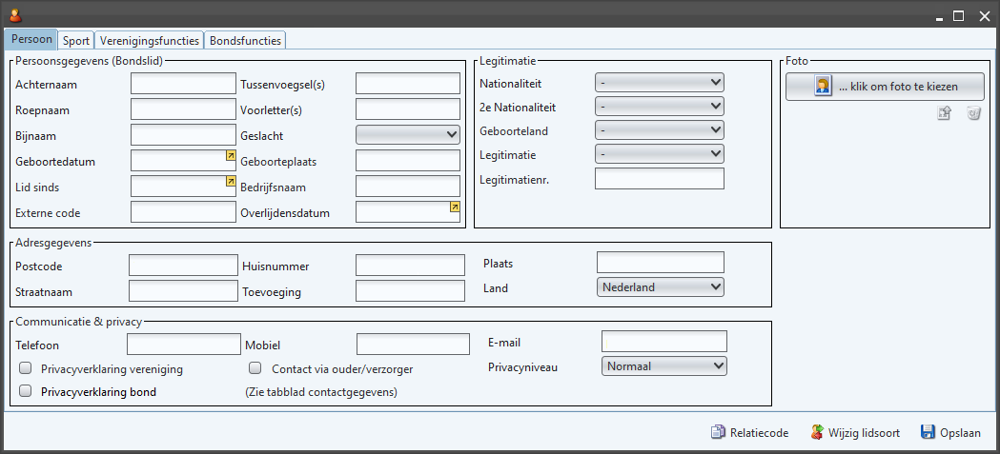

Personaldata screen

1.  Persoonsgegevens:

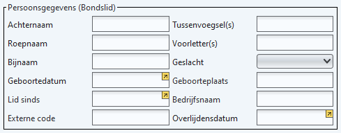

    Personaldata screen - name section

   Hierbij zijn de velden als volgt;

-   Achternaam, Tussenvoegsel, Roepnaam en Voorletter(s).  
    Voor deze velden geld dat alleen het veld Tussenvoegsel optioneel is de rest
    is verplicht.  
    Achternaam is bij een dubbele achternaam gescheiden door een "-" zonder
    spaties.

   Voorletter(s) zijn alle hoofdletters gescheiden en eindigend op een ".".

-   Geslacht, is ingevuld volgens de dropdown opties en Geboorteplaats in
    hoofdletters.

-   Geboortedatum en lid sinds.  
    Deze zijn binnen Sportlink afgedwongen in het formaat dd-mnd-yyyy.

-   Bijnaam, Bedrijfsnaam, Externe code en Overlijdensdatum.  
    Deze velden worden niet gebruikt en zijn leeg.

1.  Adresgegevens:

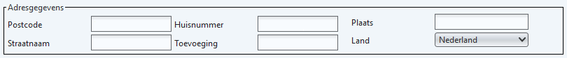

    Personaldata screen - address section

    Hierbij zijn de velden als volgt;

    -   Postcode, Huisnummer, Plaats, Straatnaam, Toevoeging en Land.

   Voor deze velden geld dat alleen het veld Toevoeging optioneel is de rest is
   verplicht.

   Postcode bestaat uit vier cijfers, gevolgd door een spatie en daarna twee
   hoofdletters.

   Plaats is volledig in hoofdletters.

1.  Communicatie & privacy:

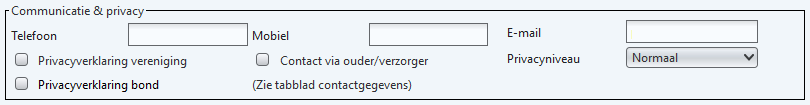

    Personaldata screen - communication section

    Hierbij zijn de velden als volgt;

-   Telefoon, mobiel en E-mail. Deze drie velden zijn optioneel en zijn niet
    opgenomen in het HR als te delen gegevens. Ga hier dus voorzichtig mee om.
    Indien ze wel ingezet worden doe dit dan als volgt (gezien Sportlink zelf
    geen formaat afdwingt);

   Telefoon nummers altijd volgens Nederlandse notatie opnemen,  
   Bij een 3 cijferig net nummer 123 456 78 90 en bij 4 cijfers 1234 56 78 90.

   Mobiele nummers eveneens maar die notatie is daarbij altijd 06 34 56 78 90.

   E-mail adressen dienen altijd in kleine letters (lower case) toegevoegd te
   worden.

-   Privacyniveau. Wordt niet actief gebruikt, de standaard waarde is normaal.  
    De volgende opties zijn beschikbaar en betekenen volgens Sportlink het
    volgende;

    -   Privé, bedoeld voor mensen die zo min mogelijk gegevens willen delen. In
        het algemeen geldt dat de persoon als Anoniem wordt getoond en niet is
        te vinden bij zoekopdrachten.

    -   Normaal, bedoeld voor de "gemiddelde" sporter. In het algemeen geldt dat
        persoon wel wordt getoond, maar gegevens (zoals foto) beperkt zichtbaar
        zijn.

    -   Open, bedoeld voor mensen die weinig problemen hebben met het delen van
        gegevens. In het algemeen geldt dat gegevens van persoon wel worden
        getoond.

-   Overige vinkjes.

   Worden momenteel niet gebruikt en zijn bij iedereen leeg.

1.  Legitimatie:

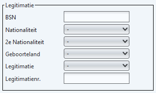

    Personaldata screen - id section

    Hierbij zijn de velden als volgt;

-   BSN.

   **MAG ZEKER NIET WORDEN GEVULD.**

-   Nationaliteit, Geboorteland, Legitimatie en Legitimatienr.

   Mogen eveneens niet worden verzameld conform HR/VO en kunnen door ons ook
   niet in Sportlink worden opgenomen gezien deze daarna meteen met derde
   gedeeld worden.

1.  Foto:

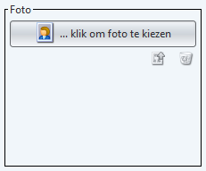

    Personaldata screen - photo section

    Hierbij is het veld als volgt;

-   Foto.

   **Mag niet worden gevuld**, bevat mogelijk foto’s als een andere brigade
   deze toegevoegd.  
   Het toevoegen van foto’s betekend dat deze automatisch met andere brigade’s
   en de bond gedeeld worden. Dit is in strijd met de AVG. Indien foto’s
   beschikbaar dienen te zijn binnen de vereniging, gebruik dan de Club.Redders
   pasfoto module.

### Leden beheren

Voor het leden beheer dient ervanuit uit gegaan te worden dat mutaties als volgt
plaatsvinden;

| **Mutatie**             | **Eerst doorvoeren in** | **Daarna doorvoeren in**                    | **Controle d.m.v.**                              |
|-------------------------|-------------------------|---------------------------------------------|--------------------------------------------------|
| Aanmaken van een lid    | Sportlink               | Club.Redders                                | Differentiatie lijst                             |
| Wijzigen van een lid    | Club.Redders            | Sportlink                                   | Differentiatie lijst                             |
|                         |                         | (indien van toepassing)                     | (indien basis gegevens, bij jaarlijkse controle) |
| Verwijderen van een lid | Volgens eigen procedure | Differentiatie lijst                        |                                                  |
|                         |                         | (advies controle 1 week voor peildata bond) |                                                  |

#### Aanmaken

Voor het aanmaken van het lid dient de werkwijze van het bond systeem gevolgd te
worden waarbij na toevoegen van het lid aan de leden administratie de basis
gegevens opgevoerd/ingesteld worden conform §3.3. Let erop dat een lid bij een
inschrijving andere gegevens heeft ingevuld dan in Sportlink staan geregistreerd
mocht het betreffende lid ook elders lid zijn.

Na deze controle dient het lid verder opgevoerd te worden in Club.Redders
waarbij het Sportlink nummer als lid nummer dient te worden opgevoerd. Vandaar
dat een lid eerst in Sportlink wordt opgevoerd. Dit is tevens de grondslag voor
de controle commissie van de bond dat wij leden altijd in Sportlink hebben staan
(of i.i.g een gelijk of groter aantal dan in Club.Redders).

#### Wijzigen

Leden kunnen via Club.Redders / Club.Forms wijzigingen indienen. Andere
verenigingen, het rayon en de bond kunnen wijzigingen doorvoeren in Sportlink.
Het is daarom verstandig de wijzigingen van leden automatisch door te laten
voeren in Club.Redders waarna deze via een melding bij de secretaris of
ledenadministrateur ook worden doorgevoerd in Sportlink voor wat betreft de
wijziging gegevens betreft die daar worden opgeslagen.

#### Verwijderen

Het verwijderen van leden dient te gebeuren in beide systemen. Via Club.Redders
/ Club.Forms meld een lid zich af. Indien het lid geen betalingsachterstand
heeft kan de secretaris de opzegging in het systeem accorderen en daarna
handmatig in Sportlink verwerken. Indien het lid toestemming heeft gegeven zijn
gegevens te bewaren wordt deze in Club.Redders geregistreerd als oud lid. In
Sportlink is het echter mogelijk gegevens van alle oud leden in te zien. Ook als
hier geen toestemming voor is gegeven! Wederom een belangrijk argument daar zo
min mogelijk gegevens in te verwerken.

### Ledenbestand vergelijken

Toelichten op vergelijken ledenbestand en automatisch doorvoeren wijzigen in CR
of handmatig in SL.

Wijs er op dat bij de 1e je vertrouwd op gegevens die 3de kunnen wijzigen en bij
de 2e op je eigen administratie en wat leden jouw vertellen!

## Gegevens exporteren

Export instructies Sportlink data

-   Leden gegevens t.b.v. vergelijking ledenadministratie.

-   Bondsdiploma's (worden door de bond beheerd in Sportlink).

-   Bondsfuncties (worden door de bond beheerd in Sportlink).

Exports worden in Sportlink gemaakt vanuit het zoekscherm;

-   Open het zoekscherm door op

    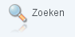

    te klikken vanuit het hoodscherm;

1.  Je komt nu eerst in het zoekscherm Personen;

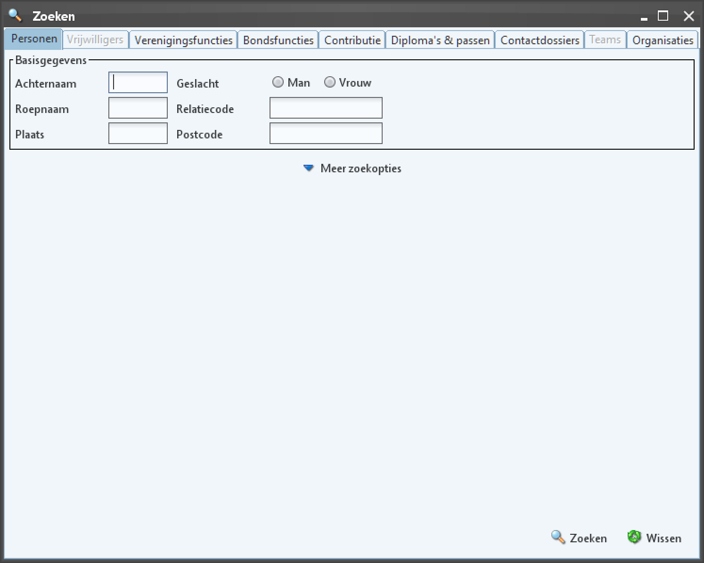

    Search screen

### Leden gegevens

1.  Gebruik in het zoekscherm het tabblad “Personen” en klik op zoeken.

   Hier gaan we de leden exporteren. Selecteer “Meer zoekopties”;

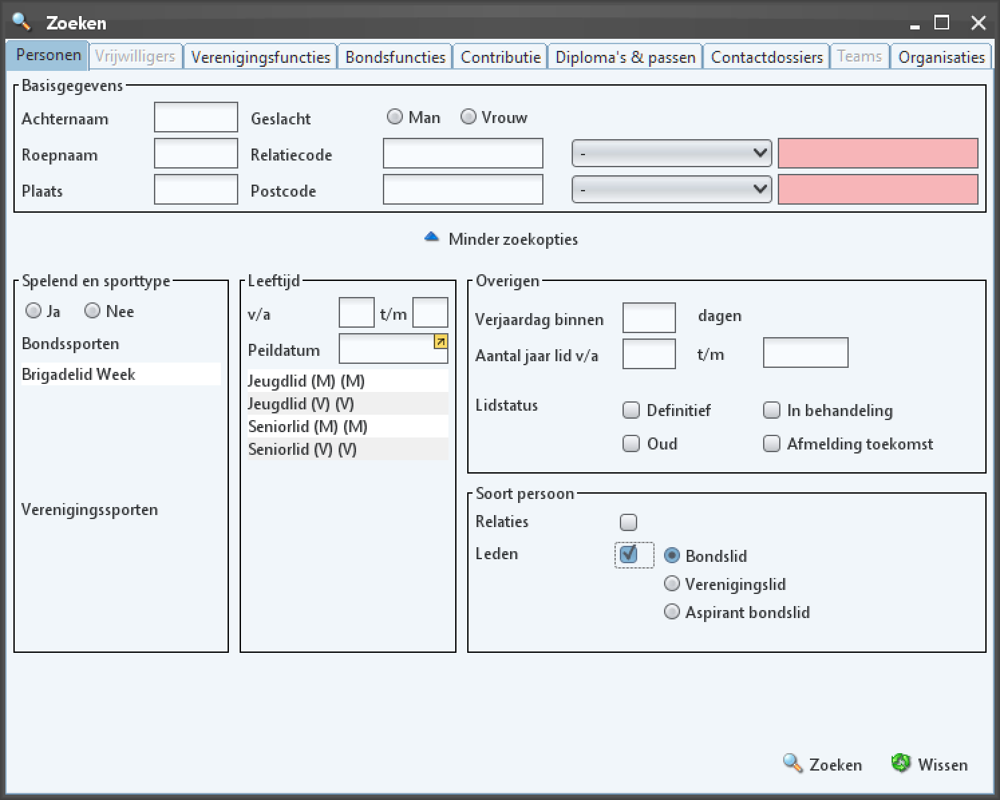

   Search screen - persons

   Selecteer Leden onder Soort persoon en klik op zoeken.

1.  Het scherm gevonden leden opend zich nu met alle huidige leden.  
    Onderaan dit scherm zitten de volgende knoppen:

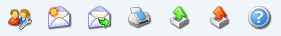

    Icons set

    Gebruik

    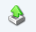

    om de gegevens te exporteren ná kolom selectie;

1.  Het keuze scherm met de export opties opend zich nu;

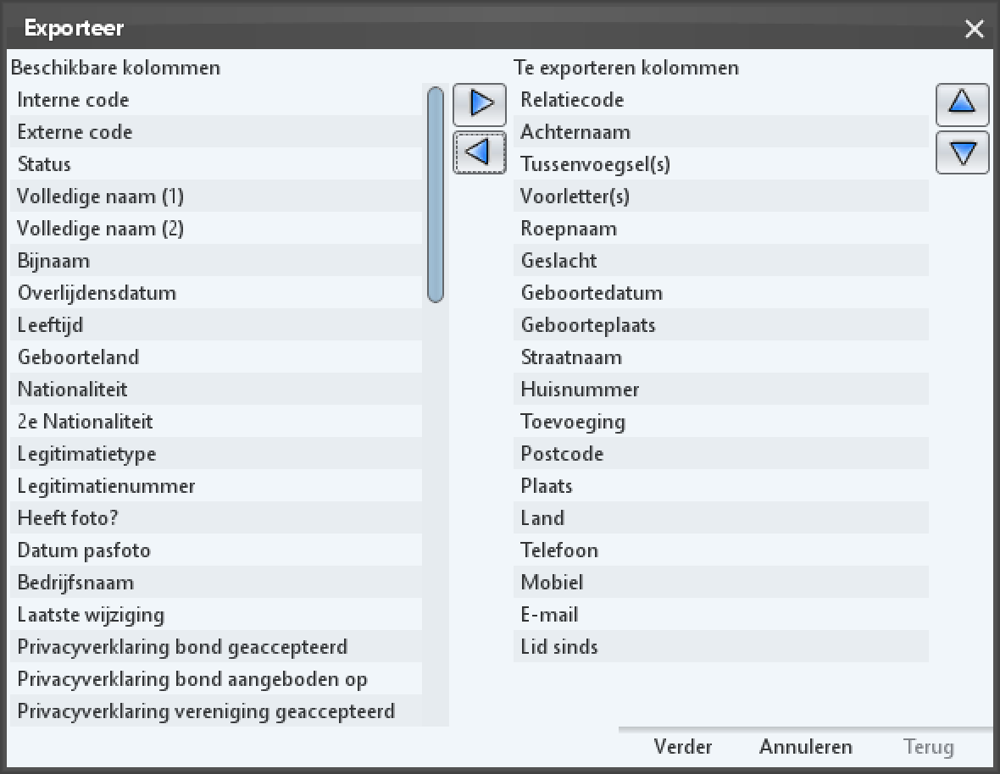

    Export data - members

Vul de lijst rechts met de gegevens uit de linker kolom volgens bovenstaande
volgorde.

*De volgende kolom mag NOOIT geexporteerd worden:*

-   BSN  
    Bij wet verboden te registreren, laat staan export/import handelingen.

-   Volledige naam (1)  
    Maakt de export bestanden stuk door de wijze waarop Sportlink dit veld
    samensteld.

1.  Klik op Verder en kies hier voor exporteren als Puntkomma *zonder*
    kolomnamen.

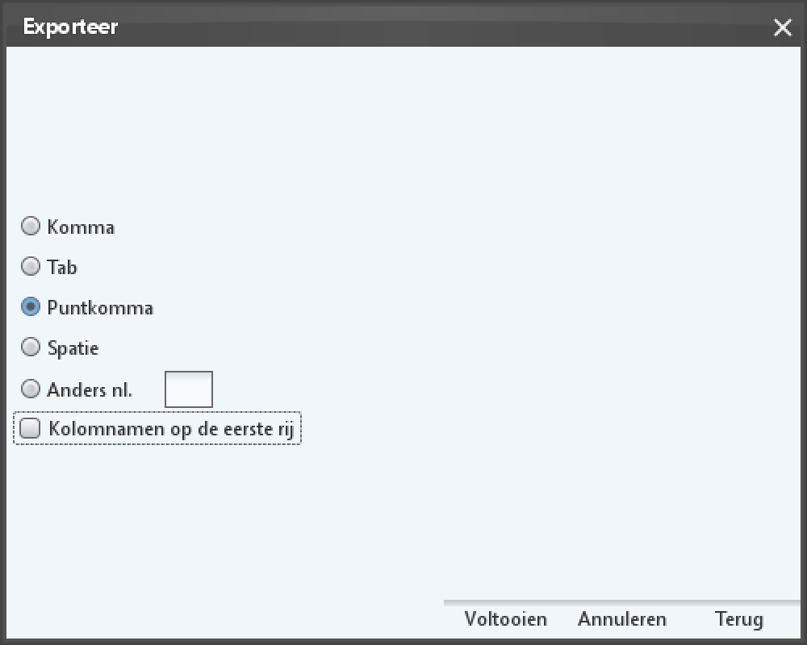

    Export data - options

1.  Klik op Voltooien en sla het bestand op een veilige en binnen de vereniging
    afgesproken locatie op als “leden.csv”. Let op: het export bestand bevat
    privacy gevoelige gegevens welke enkel binnen de ledenadministratie en
    Club.Redders mogen bestaan. De export is enkel noodzakelijk voor het
    overzetten/koppelen van de data. Verwijder na het importeren van deze data
    binnen Club.Redders altijd deze export bestanden. Club.Redders maakt daarna
    automatisch een backup van deze data zoals deze op moment van export
    bestonden in SportLink.

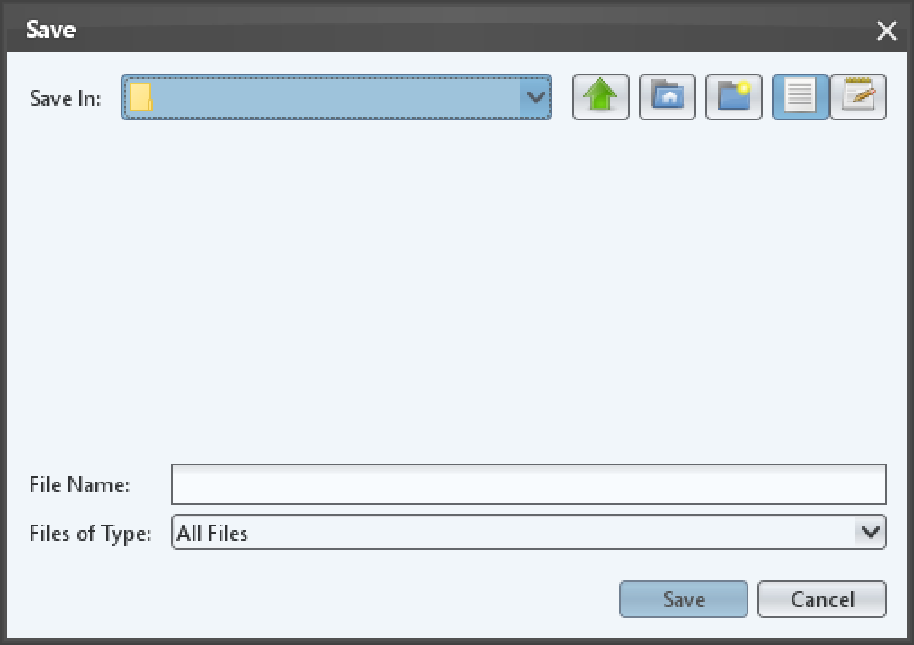

    Export data - save as

### Bondsdiploma’s

1.  Gebruik in het zoekscherm het tabblad “Diploma’s & Passen” en klik op
    zoeken.

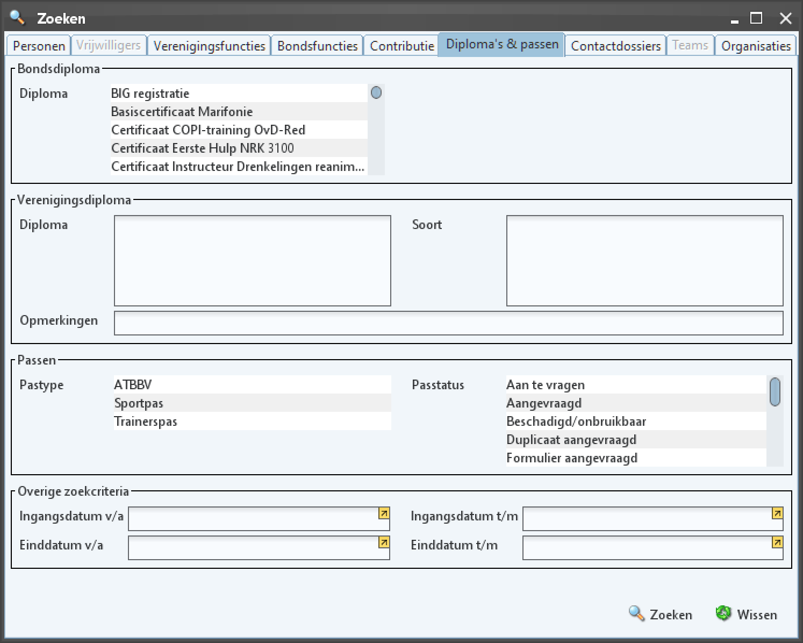

    Search screen - certifications

1.  Het scherm gevonden personen opend zich nu met alle huidige leden.  
    Onderaan dit scherm zitten de volgende knoppen:

    Icons set

   Gebruik

   Icon - export

   om de gegevens te exporteren ná kolom selectie;

1.  Het keuze scherm met de export opties opend zich nu;

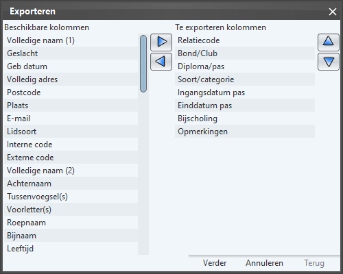

    Export data - certifications

   Vul de lijst rechts met de volgende gegevens uit de linker kolom op
   volgorde;

-   Relatiecode

-   Bond/Club

-   Diploma/pas

-   Soort/categorie

-   Ingangsdatum pas

-   Einddatum pas

-   Bijscholing

-   Opmerkingen

1.  Klik op Verder en kies hier voor exporteren als Puntkomma *zonder*
    kolomnamen.

    Export data - options

1.  Klik op Voltooien en sla het bestand op een veilige en binnen de vereniging
    afgesproken locatie op als “diplomas.csv”. Let op: het export bestand bevat
    privacy gevoelige gegevens welke enkel binnen de ledenadministratie en
    Club.Redders mogen bestaan. De export is enkel noodzakelijk voor het
    overzetten/koppelen van de data. Verwijder na het importeren van deze data
    binnen Club.Redders altijd deze export bestanden. Club.Redders maakt daarna
    automatisch een backup van deze data zoals deze op moment van export
    bestonden in SportLink.

    Export data - save as

### Bondsfuncties

1.  Gebruik in het zoekscherm het tabblad “Bondsfuncties”.

   Selecteer hier alle Official en Functie opties en klik op zoeken.

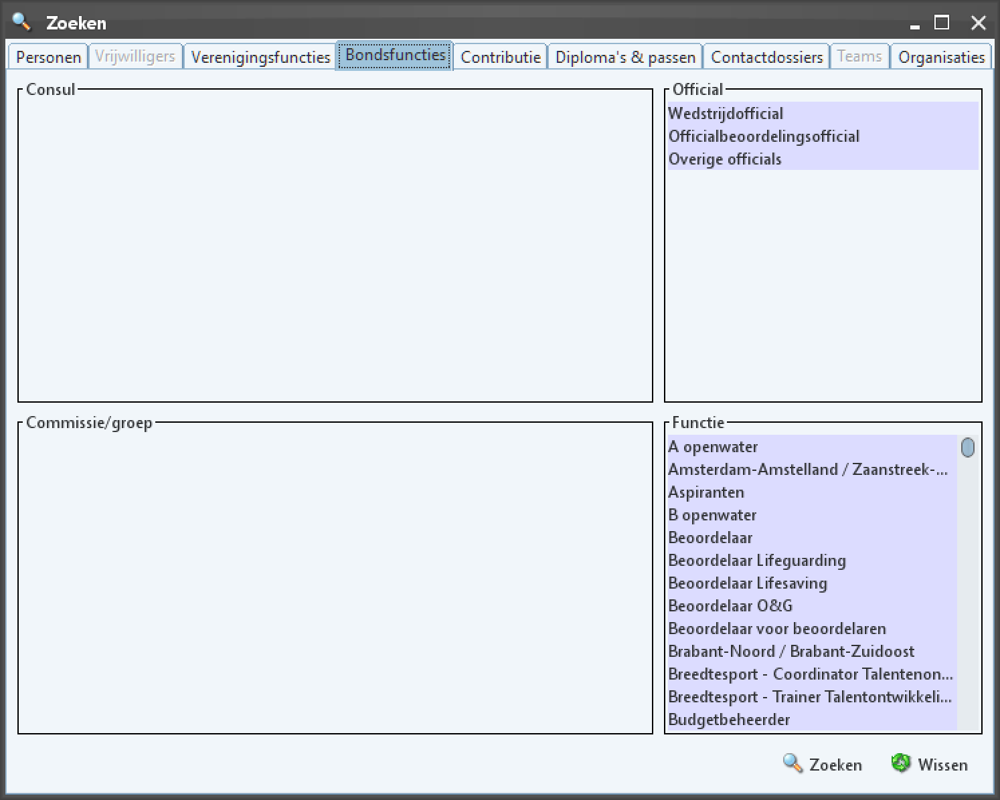

   Search screen - functions

1.  Het scherm gevonden personen opend zich nu met alle huidige leden.  
    Onderaan dit scherm zitten de volgende knoppen:

    Icons set

   Gebruik

   Icon - export

   om de gegevens te exporteren ná kolom selectie;

1.  Het keuze scherm met de kolom opties opend zich nu;

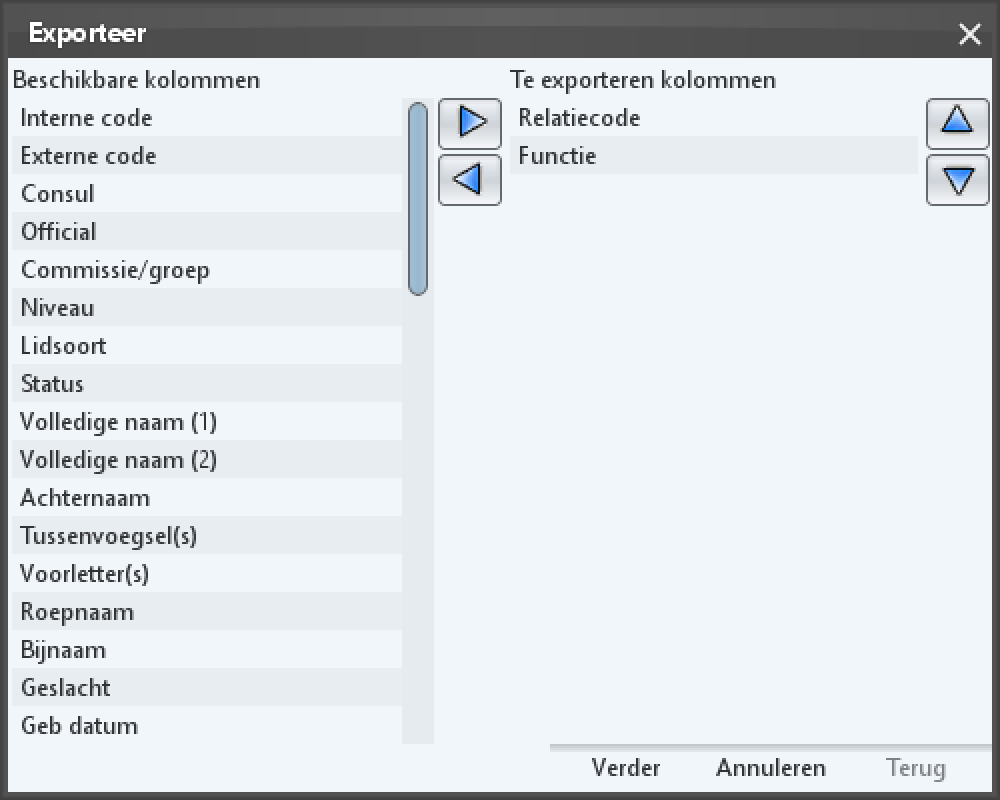

    Export data - functions

   Vul de lijst rechts met de volgende gegevens uit de linker kolom op
   volgorde;

-   Relatiecode

-   Functie

1.  Klik op Verder en kies hier voor exporteren als Puntkomma *zonder*
    kolomnamen.

    Export data - options

1.  Klik op Voltooien en sla het bestand op een veilige en binnen de vereniging
    afgesproken locatie op als “functies.csv”. Let op: het export bestand bevat
    privacy gevoelige gegevens welke enkel binnen de ledenadministratie en
    Club.Redders mogen bestaan. De export is enkel noodzakelijk voor het
    overzetten/koppelen van de data. Verwijder na het importeren van deze data
    binnen Club.Redders altijd deze export bestanden. Club.Redders maakt daarna
    automatisch een backup van deze data zoals deze op moment van export
    bestonden in SportLink.

    export data - save as

## Veelgestelde vragen

### Op welke plaatsen dienen rechten ingeregeld te worden?

Uitgaande van onderstaande tooling is toegang noodzakelijk voor;

| **Tooling**           | **Accout**            | **Toegang nodig voor** | **Rechten krijg je door**         |
|-----------------------|-----------------------|------------------------|-----------------------------------|
| Office 365 / Azure AD | Intern account        | Alle leden             | Work in progress                  |
| Club.Redders (ResQ)   | O365-account (SSO)    | \-                     | Work in progress                  |
| WordPress             | O365-account (SSO)    | \-                     | Automatisch                       |
| MachForm              | Intern account        | Kader leden            | Work in progress                  |
| Akounting             | Intern account        | Bestuur + Kascommissie | Work in progress                  |
| *Systeem van de bond* | Intern account        | Bestuur                | Handmatig via bestuur             |
| KeeWeb                | Geen account          | Vrij toegankelijk      | n.v.t.                            |
| Webhosting            | Div. interne accounts | Functionaris IT        | Handmatig via andere functionaris |
| Domeinregistratie     | Intern account        | Bestuur                | LastPass/KeePass van het bestuur  |

Momenteel wordt er gewerkt om alle rechten automatisch toe te laten kennen. Dit
geld straks voor al onze systemen m.u.v. het systeem van de bond, webhosting,
domeinregistratie en LastPass. De overige systemen werken straks met één account
en zodra je lid bent wordt je account dan automatisch aangemaakt. Een bestuurder
kan vervolgens zelf aangeven welke rechten nodig zijn.

Tot die tijd dienen voor deze systemen rechten aangevraagd te worden bij de
functionaris IT, m.u.v. het het systeem van de bond. Die rechten dienen door het
bestuur te worden toegekend en toegang is dan ook enkel nodig binnen het bestuur
zelf.

## Bijlage 1: Instellingen voor de gebruiker

Als je voor de 1e keer inlogd in Sportlink dien je eerst je wachtwoord te
wijzigen. Nadat je dit gewijzigd hebt dien je de volgende scherminstellingen in
te stellen, zodoende een prettigere gebruikerservaring te hebben;

1.  Ga in het menu naar Systeem \> Gebruikersinstellingen.

2.  Open het tabblad Persoonsscherm in het pop-up scherm.

3.  Vink hier alle tab’s uit behalve;

    -   Tab Sport

    -   Tab Verenigingsfuncties

    -   Tab Bondsfuncties

   Conform onderstaande screenshot:

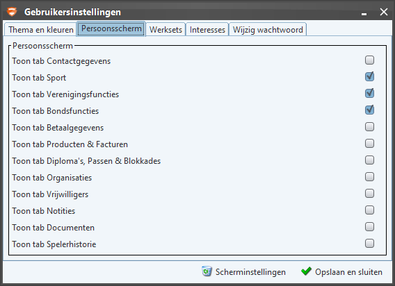

   User settings

   Afbeelding met schermafbeelding Automatisch gegenereerde beschrijving

1.  Kies voor Opslaan en sluiten.

2.  Veel succes met het gebruik van Sportlink.

## Bijlage 2: Activiteiten gegevens exporteren

1.  Gebruik in het zoekscherm het tabblad “Activiteiten” en klik op zoeken.

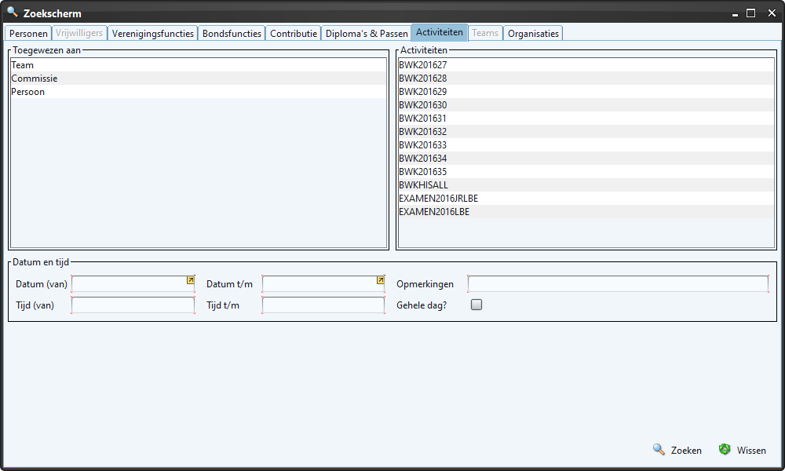

    Search screen - activities

1.  Het scherm gevonden personen opend zich nu met alle huidige leden.  
    Onderaan dit scherm zitten de volgende knoppen:

    Icons set

   Gebruik

   Icon - export

   om de gegevens te exporteren ná kolom selectie;

1.  Het keuze scherm met de kolom opties opend zich nu;

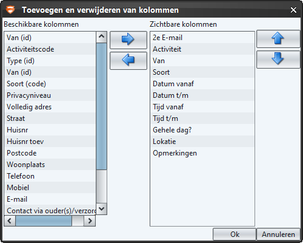

    Export data - activities

   Vul de lijst rechts met de volgende gegevens uit de linker kolom op
   volgorde;

-   2e E-mail

-   Activiteit

-   Van

-   Soort

-   Datum vanaf

-   Datum t/m

-   Tijd vanaf

-   Tijd t/m

-   Gehele dag?

-   Lokatie

-   Opmerkingen

1.  Klik op Verder en kies hier voor exporteren als Puntkomma *zonder*
    kolomnamen.

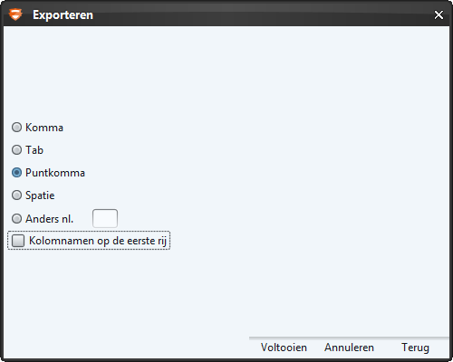

    Export data - options

1.  Klik op Voltooien en sla het bestand op een veilige en binnen de vereniging
    afgesproken locatie op als “activiteiten.csv”. Let op: het export bestand
    bevat privacy gevoelige gegevens welke enkel binnen de ledenadministratie en
    Club.Redders mogen bestaan. De export is enkel noodzakelijk voor het
    overzetten/koppelen van de data. Verwijder na het importeren van deze data
    binnen Club.Redders altijd deze export bestanden. Club.Redders maakt daarna
    automatisch een backup van deze data zoals deze op moment van export
    bestonden in SportLink.

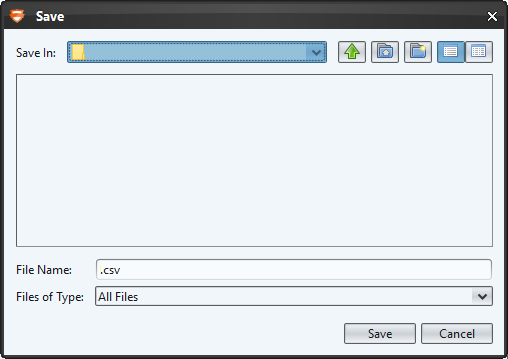

    Export data - save as